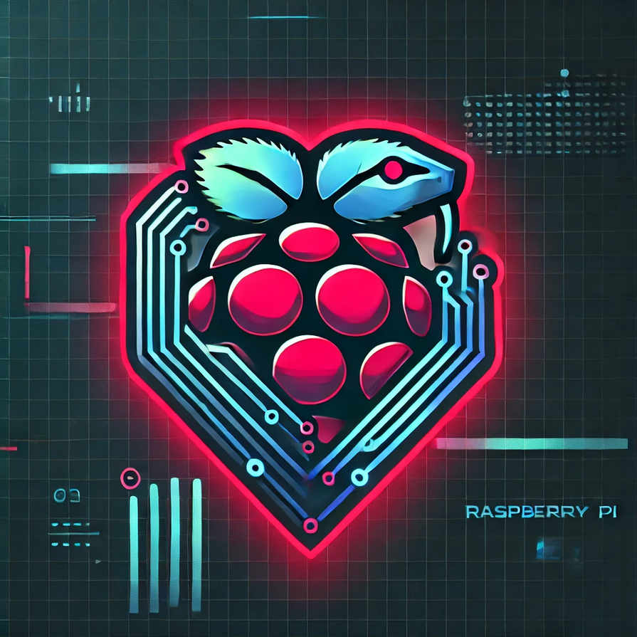

# kauli.hopto.org/kobra

## Project Description

**KobraPiV2** is a Python-based web control panel for a Raspberry Pi/home-server environment.  
It provides a small dashboard for monitoring system status, managing connected devices, controlling selected services, and displaying camera or gallery-related content.

The project is designed for a Linux/Raspberry Pi setup and combines a Flask web interface with hardware/service control features.

## Technical Features

- Python 3.11 web application
- Flask-based dashboard
- Gunicorn-ready server configuration
- Basic authentication for protected actions
- systemd service status and control support
- Tasmota-compatible power/device control
- Raspberry Pi/system monitoring data
- Telegram notification integration
- Static image gallery with thumbnail generation
- Jinja2 template-based frontend

## Tech Stack

- Python
- Flask
- Jinja2
- Werkzeug
- Requests
- Pillow
- psutil
- Flask-HTTPAuth
- Flask-CORS
- Gunicorn